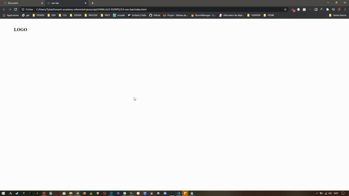

**_La nav-bar à l'affichage dynamique_**

    A partir du HTML disponible, faire en sorte que lorsqu'on clique sur le gogo, la nav-bar apparaisse si elle est cachée, et disparaisse si elle est visible

---

**_Affichage_**

