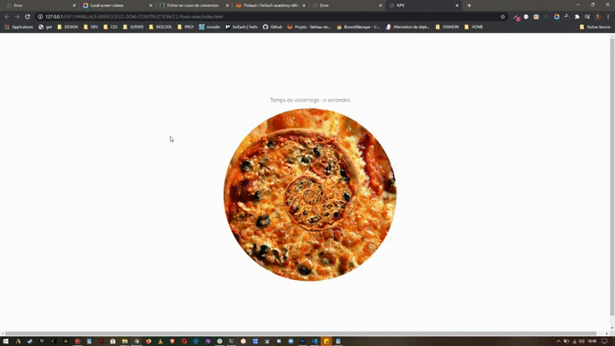

**_FOODRELAX_**

    Un ami a besoin de votre aide !

    Il a un problème de consommation de pizza et son médecin l'a contraint à respecter une diète stricte.

    Cet exercice lui a fait perdre le sommeil et il ne sait plus vers qui se tourner pour l'aider à cesser sa consommation sans perdre son sommeil.

    Vous connaissez le meilleur moyen de résoudre son problème : une application d'auto-hypnose.

---

**_Un peu d'organisation_**

    Vous formalisez la solution ainsi :

    Je dois afficher une image animée qui représente une pizza tournoyant à l'infini.

    Un chronomètre doit afficher le temps total que l'utilisateur a passé à regarder l'image affichée, et ceci en secondes.

    La feuille de style vous est fournie par un collègue UX designer et l'image aussi

    Le code doit être écrit dans un fonction qui doit être appelée au chargement de la page dans le navigateur.

---

**_Modèle HTML_**

    <article>
       

            
Temps de visionnage : 0 secondes

       

        
    </article>

---

**_AFFICHAGE_**

