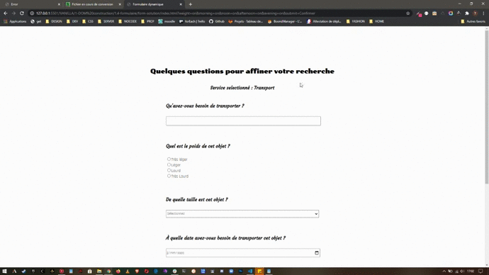

**_LE FORMULAIRE DE PRÉCISION_**

    Un nouveau client possède déjà une plateforme de Jobbying qui permet de s'échanger des services moyennant argent.

    Ce client a besoin d'une page qui permet à l'utilisateur de préciser un certain nombre d'informations sur une demande de transport le concernant.

    Il a besoin de générer cette page pour un nombre indéfini de catégories de demande utilisateur. Toutes ces catégories étant différentes, le formulaire doit être résilient. C'est à dire qu'il doit permettre d'afficher n'importe quelle nombre de questions, n'importe quelles réponses préderterminées à ces questions, et n'importe quel input adéquat par rapport à chaque question.

    Heureusement, vous possèdez déjà un échantillon de données à traiter, et qui sert de modèle.

---

**_LA DATA_**

    const data = {
    categoryLabel: "Transport",
    questions: [
        {
            id: 1,
            code: 12456789,
            order: 1000,
            archived: false,
            type: "text",
            label: "Qu'avez-vous besoin de transporter ?",
            responses: []
        },
        {
            id: 2,
            code: 142567945,
            order: 2000,
            archived: false,
            type: "radio",
            label: "Quel est le poids de cet objet ?",
            responses: [
                {
                    id: 2,
                    code: 243164578,
                    order: 1000,
                    archived: false,
                    name: "weight",
                    label: "Très léger"
                },
                {
                    id: 3,
                    code: 431645745,
                    order: 2000,
                    archived: false,
                    name: "weight",
                    label: "Léger"
                },
                {
                    id: 4,
                    code: 34664315,
                    order: 3000,
                    archived: false,
                    name: "weight",
                    label: "Lourd"
                },
                {
                    id: 5,
                    code: 436694557,
                    order: 4000,
                    archived: false,
                    name: "weight",
                    label: "Très Lourd"
                },
            ]
        },
        {
            id: 3,
            code: 134675495,
            order: 3000,
            archived: false,
            type: "select",
            label: "De quelle taille est cet objet ?",
            responses: [
                {
                    id: 5,
                    code: 243164578,
                    order: 1000,
                    archived: false,
                    name: "veryLittle",
                    label: "Très petit"
                },
                {
                    id: 6,
                    code: 431645745,
                    order: 2000,
                    archived: false,
                    name: "little",
                    label: "Petit"
                },
                {
                    id: 7,
                    code: 34664315,
                    order: 3000,
                    archived: false,
                    name: "big",
                    label: "Grand"
                },
                {
                    id: 8,
                    code: 436694557,
                    order: 4000,
                    archived: false,
                    name: "veryBig",
                    label: "Très Grand"
                },
            ]
        },
        {
            id: 4,
            code: 143764578,
            order: 4000,
            archived: false,
            type: "date",
            label: "À quelle date avez-vous besoin de transporter cet objet ?",
            responses: []
        },
        {
            id: 5,
            code: 431645724,
            order: 5000,
            archived: false,
            type: "checkbox",
            label: "Quelle créneau horaire vous conviendrait ?",
            responses: [
                {
                    id: 9,
                    code: 436694557,
                    order: 1000,
                    archived: false,
                    name: "morning",
                    label: "08h00 - 12h00"
                },
                {
                    id: 10,
                    code: 436694557,
                    order: 2000,
                    archived: false,
                    name: "noon",
                    label: "12h00 - 14h00"
                },
                {
                    id: 11,
                    code: 436694557,
                    order: 3000,
                    archived: false,
                    name: "afternoon",
                    label: "14h00 - 18h00"
                },
                {
                    id: 12,
                    code: 436694557,
                    order: 4000,
                    archived: false,
                    name: "evening",
                    label: "18h00 - 20h00"
                },
            ]
        },
        {
            id: 5,
            code: 431645724,
            order: 5000,
            archived: false,
            type: "textarea",
            label: "Avez-vous quelque chose à ajouter ?",
            responses: []
        }
        ]
    }

---

**_Le modèle HTML_**

        <body>
            <form action="">
                <h2>Quelques questions pour affiner votre recherche</h2>
                <h3>Service seletionné : Transport</h3>
                <input type="hidden" value="transport" name="transport" id="transport">
                <section class="question-ctn">
                    <h3>Qu'avez-vous besoin de transporter ?</h3>
                    

                        <input type="text" name="type" id="type">
                    

                </section>
                <section class="question-ctn">
                    <h3>Quel est le poids de cet objet ?</h3>
                    

                        <input type="radio" name="weight" id="veryLight">
                        <label for="veryLight">Très léger</label>

                    

                    

                        <input type="radio" name="weight" id="light">
                        <label for="light">léger</label>

                    

                    

                        <input type="radio" name="weight" id="heavy">
                        <label for="heavy">Lourd</label>

                    

                    

                        <input type="radio" name="weight" id="veryHeavy">
                        <label for="veryHeavy">Très lourd</label>

                    

                </section>
                <section class="question-ctn">
                    

                        <h3>De quelle taille est cet objet ?</h3>
                        <select name="volume" id="volume">
                            <option value="select">Sélectionnez</option>
                            <option value="veryLittle">Très petit</option>
                            <option value="little">Petit</option>
                            <option value="big">Grand</option>
                            <option value="veryBig">Très grand</option>

                        </select>
                    

                </section>
                <section class="question-ctn">
                    <h3>À quelle date avez-vous besoin de transporter cet objet ?</h3>
                    

                        <input type="date" name="date" id="date">
                    

                </section>
                <section class="question-ctn">
                    <h3>Quelle créneau horaire vous conviendrait ?</h3>
                    

                        <input type="checkbox" name="morning" id="morning">
                        <label for="morning">08h00 - 12h00</label>

                    

                    

                        <input type="checkbox" name="noon" id="noon">
                        <label for="noon">12h00 - 14h00</label>

                    

                    

                        <input type="checkbox" name="afternoon" id="afternoon">
                        <label for="afternoon">14h00 - 18h00</label>

                    

                    

                        <input type="checkbox" name="evening" id="evening">
                        <label for="evening">18h00 - 20h00</label>

                    

                </section>
                <section class="question-ctn">
                    <h3>Avez-vous quelque chose à suggérer ?</h3>
                    

                    <textarea name="suggestion" id="suggestion"></textarea>
                    

                </section>
                

                    <input type="submit" value="Confirmer">
                

            </form>
        </body>

---

**_L'affichage final_**

