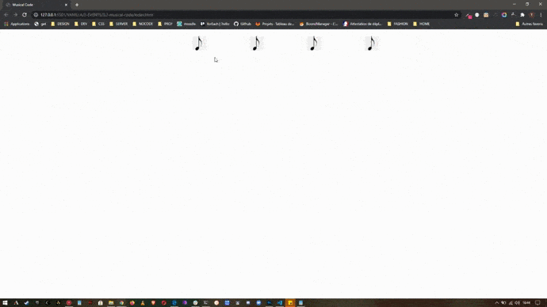

**_LE CODE MUSICAL_**

    La boite de nuit à la mode désire licencier son videur et vous demande de construire un système de code musical pour ouvrir la porte automatiquement lorsque l'utilisateur entre la bonne mélodie

    Chaque touche de l'interface doit jouer la bonne note au clic, c'est à dire que chaque note doit être entendue
    La bonne séquence doit comporter 4 notes et doivent être incluses dans un tableau

    Si la porte s'ouvre, l'image de Neo doit être affichée
    Si la porte reste fermée ou se ferme, l'image de gandalf doit être affichée

---

**_AFFICHAGE :_**

