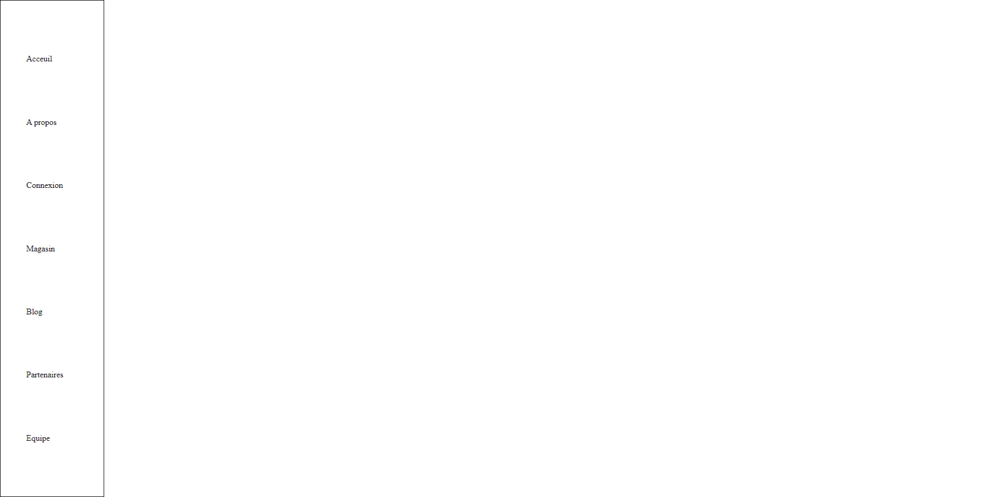

## **_LA NAVBAR AU CONTENU DYNAMIQUE_**

Créez un programme qui permet d'automatiser l'affichage du contenu d'une barre de navigation à partir d'un tableau de données.

**_LA DATA_**

            const navItems = [
                {
                    label: "Acceuil",
                    href: "/",
                },
                {
                    label: "A&nbsp;propos",
                    href: "/about",
                },
                {
                    label: "Connexion",
                    href: "/login",
                },
                {
                    label: "Magasin",
                    href: "/shop",
                },
                {
                    label: "Blog",
                    href: "/blog",
                },
                {
                    label: "Partenaires",
                    href: "/partners",
                },
                {
                    label: "Equipe",
                    href: "/tems",
                },
            ];

**_Le modèle HTML_**

    <nav>
        <ul>
            <li class="nav-item">
                <a href="/" class="nav-item-link">Acceuil</a>
            </li>
            <li class="nav-item">
                <a href="/about" class="nav-item-link">A&nbsp;propos</a>
            </li>
            <li class="nav-item">
                <a href="/login" class="nav-item-link">Connexion</a>
            </li>
            <li class="nav-item">
                <a href="/shop" class="nav-item-link">Magasin</a>
            </li>
            <li class="nav-item">
                <a href="/blog" class="nav-item-link">Blog</a>
            </li>
            <li class="nav-item">
                <a href="/partners" class="nav-item-link">Partenaires</a>
            </li>
            <li class="nav-item">
                <a href="/team" class="nav-item-link">Equipe</a>
            </li>
        </ul>
    </nav>

**_L'Affichage final_**

