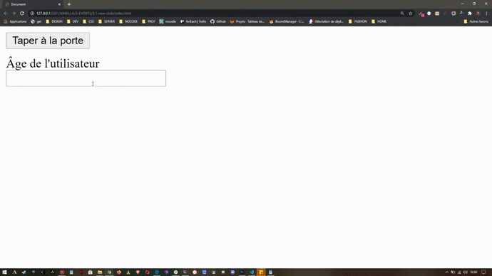

**_*LE VIDEUR DE BOITE DE NUIT*_**

    Vous voulez entrez dans une nouvelle boite de nuit à la mode.
    Arrivé devant la porte, le videur vous demande votre âge.

    Créez une application qui permet de gérer la décision du videur en fonction de :
    - votre âge
    - une limite d'âge basse égale à 18 ans
    - une limite d'âge haute égale à 70 ans

    En fonction de cette décision, le videur vous autorisera verbalement à entrer en boite.
    Cette autorisation sera prendra l'un des 3 formaes suivantes:

    - Vous avez <âge> ans, désolé, revenez quand vous en aurez <limite d'âge basse>
    - Vous avez <âge> ans, vous êtes donc majeur et notre limite est <limite d'âge haute>, bienvenue.
    - Vous avez <âge> ans. Désolé nous n'acceptons pas les personnes qui ont plus de <limite d'âge haute> ans

    Ce message devra être affiché dan l'élément HTML approprié.

---

**_*AMÉLIORATIONS*_**

- ajouter une fonction qui permet le même résultat quand l'utilisateur appuie sur la touche entrée du clavier lorsque l'input utilisateur est actif

---

**_AFFICHAGE_** :

