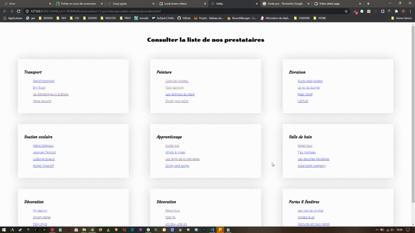
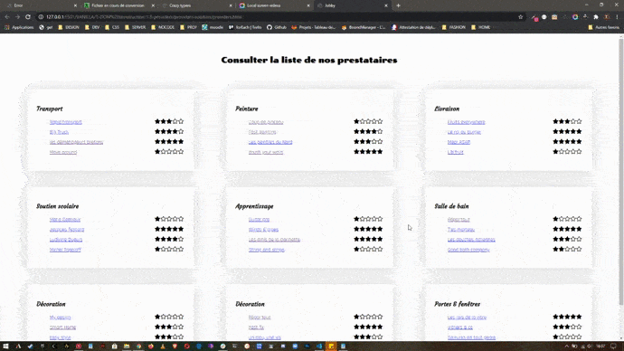

## **LA LISTE DES PRESTATAIRES**

    Un de vos client a une demande concernant son site de prestation de services.

    Une page de son site web liste des prestataires par catégorie de service.

    Le nombre de ces catégories et de ces services croît très rapidement.

    Dans un premier temps, ce client aurait besoin d'un script qui permette d'automatiser le rendu HTML pour éviter de devoir retoucher systématiquement à son code HTML statique.

    Quand un client clique sur le nom d'un prestataire, celui-ci doit permettre la redirection vers le site "let me google that" avec en objet de recherche le nom de ce prestataire

    Dans un second temps, il aimerait que ses clients puissent visualiser une évaluation de la qualité du travail de chaque prestataire de service, via un système d'étoiles vides et d'étoiles pleines.

---

**_LA DATA_**

    const categories = [
    {
        id: 1,
        code: 123456789,
        label: "Transport",
        providers: [
            {
                id: 1,
                code: 321654987,
                label: "Rapid'transport",
                stars: 3
            },
            {
                id: 2,
                code: 321654987,
                label: "Big Truck",
                stars: 4
            },
            {
                id: 3,
                code: 321654987,
                label: "les déménageurs bretons",
                stars: 5
            },
            {
                id: 4,
                code: 321654987,
                label: "Move around",
                stars: 1
            },
        ]
    },
    {
        id: 2,
        code: 123456789,
        label: "Peinture",
        providers: [
            {
                id: 5,
                code: 321654987,
                label: "Coup de pinceau",
                stars: 1
            },
            {
                id: 6,
                code: 321654987,
                label: "Fast painting",
                stars: 4
            },
            {
                id: 7,
                code: 321654987,
                label: "Les peintres du Nord",
                stars: 3
            },
            {
                id: 8,
                code: 321654987,
                label: "Brush your walls",
                stars: 5
            },
        ]
    },
    {
        id: 3,
        code: 123456789,
        label: "Livraison",
        providers: [
            {
                id: 9,
                code: 321654987,
                label: "Fruits everywhere",
                stars: 3
            },
            {
                id: 10,
                code: 321654987,
                label: "Le roi du burger",
                stars: 5
            },
            {
                id: 11,
                code: 321654987,
                label: "Meal ASAP",
                stars: 5
            },
            {
                id: 12,
                code: 321654987,
                label: "Lib'fruit",
                stars: 1
            },
        ]
    },
    {
        id: 4,
        code: 123456789,
        label: "Soutien scolaire",
        providers: [
            {
                id: 13,
                code: 321654987,
                label: "Marie Demieux",
                stars: 1
            },
            {
                id: 14,
                code: 321654987,
                label: "Jacques Testard",
                stars: 5
            },
            {
                id: 15,
                code: 321654987,
                label: "Ludivine Dupuis",
                stars: 4
            },
            {
                id: 16,
                code: 321654987,
                label: "Michel Topaloff",
                stars: 1
            },
        ]
    },
    {
        id: 5,
        code: 123456789,
        label: "Apprentissage",
        providers: [
            {
                id: 17,
                code: 321654987,
                label: "Guitar pro",
                stars: 1
            },
            {
                id: 18,
                code: 321654987,
                label: "Winds & pipes",
                stars: 5
            },
            {
                id: 19,
                code: 321654987,
                label: "Les amis de la clarinette",
                stars: 5
            },
            {
                id: 20,
                code: 321654987,
                label: "String and songs",
                stars: 1
            },
        ]
    },
    {
        id: 6,
        code: 123456789,
        label: "Salle de bain",
        providers: [
            {
                id: 21,
                code: 321654987,
                label: "Répar'tout",
                stars: 1
            },
            {
                id: 22,
                code: 321654987,
                label: "T'es marteau",
                stars: 5
            },
            {
                id: 23,
                code: 321654987,
                label: "Les douches italiennes",
                stars: 3
            },
            {
                id: 24,
                code: 321654987,
                label: "Good bath company",
                stars: 2
            },
        ]
    },
    {
        id: 7,
        code: 123456789,
        label: "Décoration",
        providers: [
            {
                id: 25,
                code: 321654987,
                label: "My design",
                stars: 1
            },
            {
                id: 26,
                code: 321654987,
                label: "Smart Home",
                stars: 3
            },
            {
                id: 27,
                code: 321654987,
                label: "Easy style",
                stars: 3
            },
            {
                id: 28,
                code: 321654987,
                label: "Home sweet Home",
                stars: 2
            },
        ]
    },
    {
        id: 8,
        code: 123456789,
        label: "Décoration",
        providers: [
            {
                id: 29,
                code: 321654987,
                label: "Répar'tout",
                stars: 1
            },
            {
                id: 30,
                code: 321654987,
                label: "Fast fix",
                stars: 5
            },
            {
                id: 31,
                code: 321654987,
                label: "Un clou, une vis",
                stars: 3
            },
            {
                id: 32,
                code: 321654987,
                label: "Bricol'tout",
                stars: 2
            },
        ]
    },
    {
        id: 9,
        code: 123456789,
        label: "Portes & fenêtres",
        providers: [
            {
                id: 33,
                code: 321654987,
                label: "Les rois de la vitre",
                stars: 5
            },
            {
                id: 34,
                code: 321654987,
                label: "Vitriers & co",
                stars: 3
            },
            {
                id: 35,
                code: 321654987,
                label: "Serrures en tout genre",
                stars: 1
            },
            {
                id: 36,
                code: 321654987,
                label: "Global'door",
                stars: 2
            },
        ]
    },

]

---

**_Le modèle HTML de base_**

    <section class=article-ctn>
        <article>
            <h3>Transport</h3>
            <ul>
                <li>
                    <a href=`http://letmegooglethat.com/?q=Rapidtransport`>Rapid'transport</a>
                </li>
                <li>
                    <a href=`http://letmegooglethat.com/?q=Big truck`>Big truck</a>
                </li>
                <li>
                    <a href=`http://letmegooglethat.com/?q=Les déménageurs bretons`>Les déménageurs bretons</a>
                </li>
                <li>
                    <a href=`http://letmegooglethat.com/?q=Move around`> Move around</a>
                </li>
            </ul>
        </article>
        <article>
            <h3>Peinture</h3>
            <ul>
                <li>
                    <a href=`http://letmegooglethat.com/?q=Coup de pinceau`>Coup de pinceau</a>
                </li>
                <li>
                    <a href=`http://letmegooglethat.com/?q=Fast painting`>Fast painting</a>
                </li>
                <li>
                    <a href=`http://letmegooglethat.com/?q=Les peintres du Nord`>Les peintres du Nord</a>
                </li>
                <li>
                    <a href=`http://letmegooglethat.com/?q=Brush your walls`>Brush your walls</a>
                </li>
            </ul>
        </article>
        <article>
            <h3>Livraison</h3>
            <ul>
                <li>
                    <a href=`http://letmegooglethat.com/?q=Fruits everywhere`>Fruits everywhere</a>
                </li>
                <li>
                    <a href=`http://letmegooglethat.com/?q=Le roi du burger`>Le roi du burger</a>
                </li>
                <li>
                    <a href=`http://letmegooglethat.com/?q=Meal ASAP`>Meal ASAP</a>
                </li>
                <li>
                    <a href=`http://letmegooglethat.com/?q=Lib'fruit`>Lib'fruit</a>
                </li>
            </ul>
        </article>
        <article>
            <h3>Soutien scolaire</h3>
            <ul>
                <li>
                    <a href=`http://letmegooglethat.com/?q=Marie Demieux`>Marie Demieux</a>
                </li>
                <li>
                    <a href=`http://letmegooglethat.com/?q=Jacques Testard`>Jacques Testard</a>
                </li>
                <li>
                    <a href=`http://letmegooglethat.com/?q=Ludivine Dupuis`>Ludivine Dupuis</a>
                </li>
                <li>
                    <a href=`http://letmegooglethat.com/?q=Michel Topaloff`>Michel Topaloff</a>
                </li>
            </ul>
        </article>
        <article>
            <h3>Apprentissage</h3>
            <ul>
                <li>
                    <a href=`http://letmegooglethat.com/?q=Guitar pro`>Guitar pro</a>
                </li>
                <li>
                    <a href=`http://letmegooglethat.com/?q=Winds and pipes`>Winds and pipes</a>
                </li>
                <li>
                    <a href=`http://letmegooglethat.com/?q=Les amis de la clarinette`>Les amis de la clarinette</a>
                </li>
                <li>
                    <a href=`http://letmegooglethat.com/?q=Sing and song`>Sing and song</a>
                </li>
            </ul>
        </article>
        <article>
            <h3>Salle de bain</h3>
            <ul>
                <li>
                    <a href=`http://letmegooglethat.com/?q=Répar'tout`>Répar'tout</a>
                </li>
                <li>
                    <a href=`http://letmegooglethat.com/?q=Fuit'express`>Fuit'express</a>
                </li>
                <li>
                    <a href=`http://letmegooglethat.com/?q=Les douches italiennes`>Les douches italiennes</a>
                </li>
                <li>
                    <a href=`http://letmegooglethat.com/?q=Good bath Company`>Good bath Company</a>
                </li>
            </ul>
        </article>
        <article>
            <h3>Décoration</h3>
            <ul>
                <li>
                    <a href=`http://letmegooglethat.com/?q=My design`>My design</a>
                </li>
                <li>
                    <a href=`http://letmegooglethat.com/?q=Smart home`>Smart home</a>
                </li>
                <li>
                    <a href=`http://letmegooglethat.com/?q=Easy style`>Easy style</a>
                </li>
                <li>
                    <a href=`http://letmegooglethat.com/?q=Home sweet home`>Home sweet home</a>
                </li>
            </ul>
        </article>
        <article>
            <h3>Bricolage</h3>
            <ul>
                <li>
                    <a href=`http://letmegooglethat.com/?q=Répar'tout`>Répar'tout</a>
                </li>
                <li>
                    <a href=`http://letmegooglethat.com/?q=Fast fix`>Fast fix</a>
                </li>
                <li>
                    <a href=`http://letmegooglethat.com/?q=Un clou une vis`>Un clou une vis</a>
                </li>
                <li>
                    <a href=`http://letmegooglethat.com/?q=Bricol'tout`>Bricol'tout</a>
                </li>
            </ul>
        </article>
        <article>
            <h3>Portes & Fenêtres</h3>
            <ul>
                <li>
                    <a href=`http://letmegooglethat.com/?q=Les rois de la vitre`>Les rois de la vitre</a>
                </li>
                <li>
                    <a href=`http://letmegooglethat.com/?q=Vitrier & co`>Vitrier & co</a>
                </li>
                <li>
                    <a href=`http://letmegooglethat.com/?q=Serrures en tout genre`>Serrures en tout genre</a>
                </li>
                <li>
                    <a href=`http://letmegooglethat.com/?q=Global door`>Global door</a>
                </li>
            </ul>
        </article>
    </section>

---

**_le modèle HTML avec les étoiles :_**

    <section class=article-ctn>
        <article>
            <h3>Transport</h3>
            <ul>
                <li>
                    <a href=`http://letmegooglethat.com/?q=Rapidtransport`>Rapid'transport</a>
                    
                        <i class="fas fa-star"></i>
                        <i class="fas fa-star"></i>
                        <i class="fas fa-star"></i>
                        <i class="far fa-star"></i>
                        <i class="far fa-star"></i>
                    
                </li>
                <li>
                    <a href=`http://letmegooglethat.com/?q=Big truck`>Big truck</a>
                    
                        <i class="fas fa-star"></i>
                        <i class="fas fa-star"></i>
                        <i class="fas fa-star"></i>
                        <i class="fas fa-star"></i>
                        <i class="far fa-star"></i>
                    
                </li>
                <li>
                    <a href=`http://letmegooglethat.com/?q=Les déménageurs bretons`>Les déménageurs bretons</a>
                    
                        <i class="fas fa-star"></i>
                        <i class="fas fa-star"></i>
                        <i class="fas fa-star"></i>
                        <i class="fas fa-star"></i>
                        <i class="fas fa-star"></i>
                    
                </li>
                <li>
                    <a href=`http://letmegooglethat.com/?q=Move around`> Move around</a>
                    
                        <i class="fas fa-star"></i>
                        <i class="far fa-star"></i>
                        <i class="far fa-star"></i>
                        <i class="far fa-star"></i>
                        <i class="far fa-star"></i>
                    
                </li>
            </ul>
        </article>
        <article>
            <h3>Peinture</h3>
            <ul>
                <li>
                    <a href=`http://letmegooglethat.com/?q=Coup de pinceau`>Coup de pinceau</a>
                    
                        <i class="fas fa-star"></i>
                        <i class="far fa-star"></i>
                        <i class="far fa-star"></i>
                        <i class="far fa-star"></i>
                        <i class="far fa-star"></i>
                    
                </li>
                <li>
                    <a href=`http://letmegooglethat.com/?q=Fast painting`>Fast painting</a>
                    
                        <i class="fas fa-star"></i>
                        <i class="fas fa-star"></i>
                        <i class="fas fa-star"></i>
                        <i class="fas fa-star"></i>
                        <i class="far fa-star"></i>
                    
                </li>
                <li>
                    <a href=`http://letmegooglethat.com/?q=Les peintres du Nord`>Les peintres du Nord</a>
                    
                        <i class="fas fa-star"></i>
                        <i class="fas fa-star"></i>
                        <i class="fas fa-star"></i>
                        <i class="far fa-star"></i>
                        <i class="far fa-star"></i>
                    
                </li>
                <li>
                    <a href=`http://letmegooglethat.com/?q=Brush your walls`>Brush your walls</a>
                    
                        <i class="fas fa-star"></i>
                        <i class="fas fa-star"></i>
                        <i class="fas fa-star"></i>
                        <i class="fas fa-star"></i>
                        <i class="fas fa-star"></i>
                    
                </li>
            </ul>
        </article>
        <article>
            <h3>Livraison</h3>
            <ul>
                <li>
                    <a href=`http://letmegooglethat.com/?q=Fruits everywhere`>Fruits everywhere</a>
                    
                        <i class="fas fa-star"></i>
                        <i class="fas fa-star"></i>
                        <i class="fas fa-star"></i>
                        <i class="far fa-star"></i>
                        <i class="far fa-star"></i>
                    
                </li>
                <li>
                    <a href=`http://letmegooglethat.com/?q=Le roi du burger`>Le roi du burger</a>
                    
                        <i class="fas fa-star"></i>
                        <i class="fas fa-star"></i>
                        <i class="fas fa-star"></i>
                        <i class="fas fa-star"></i>
                        <i class="fas fa-star"></i>
                    
                </li>
                <li>
                    <a href=`http://letmegooglethat.com/?q=Meal ASAP`>Meal ASAP</a>
                    
                        <i class="fas fa-star"></i>
                        <i class="fas fa-star"></i>
                        <i class="fas fa-star"></i>
                        <i class="fas fa-star"></i>
                        <i class="fas fa-star"></i>
                    
                </li>
                <li>
                    <a href=`http://letmegooglethat.com/?q=Lib'fruit`>Lib'fruit</a>
                    
                        <i class="fas fa-star"></i>
                        <i class="far fa-star"></i>
                        <i class="far fa-star"></i>
                        <i class="far fa-star"></i>
                        <i class="far fa-star"></i>
                    
                </li>
            </ul>
        </article>
        <article>
            <h3>Soutien scolaire</h3>
            <ul>
                <li>
                    <a href=`http://letmegooglethat.com/?q=Marie Demieux`>Marie Demieux</a>
                    
                        <i class="fas fa-star"></i>
                        <i class="far fa-star"></i>
                        <i class="far fa-star"></i>
                        <i class="far fa-star"></i>
                        <i class="far fa-star"></i>
                    
                </li>
                <li>
                    <a href=`http://letmegooglethat.com/?q=Jacques Testard`>Jacques Testard</a>
                    
                        <i class="fas fa-star"></i>
                        <i class="fas fa-star"></i>
                        <i class="fas fa-star"></i>
                        <i class="fas fa-star"></i>
                        <i class="fas fa-star"></i>
                    
                </li>
                <li>
                    <a href=`http://letmegooglethat.com/?q=Ludivine Dupuis`>Ludivine Dupuis</a>
                    
                        <i class="fas fa-star"></i>
                        <i class="fas fa-star"></i>
                        <i class="fas fa-star"></i>
                        <i class="fas fa-star"></i>
                        <i class="far fa-star"></i>
                    
                </li>
                <li>
                    <a href=`http://letmegooglethat.com/?q=Michel Topaloff`>Michel Topaloff</a>
                    
                        <i class="fas fa-star"></i>
                        <i class="far fa-star"></i>
                        <i class="far fa-star"></i>
                        <i class="far fa-star"></i>
                        <i class="far fa-star"></i>
                    
                </li>
            </ul>
        </article>
        <article>
            <h3>Apprentissage</h3>
            <ul>
                <li>
                    <a href=`http://letmegooglethat.com/?q=Guitar pro`>Guitar pro</a>
                    
                        <i class="fas fa-star"></i>
                        <i class="far fa-star"></i>
                        <i class="far fa-star"></i>
                        <i class="far fa-star"></i>
                        <i class="far fa-star"></i>
                    
                </li>
                <li>
                    <a href=`http://letmegooglethat.com/?q=Winds and pipes`>Winds and pipes</a>
                    
                        <i class="fas fa-star"></i>
                        <i class="fas fa-star"></i>
                        <i class="fas fa-star"></i>
                        <i class="fas fa-star"></i>
                        <i class="fas fa-star"></i>
                    
                </li>
                <li>
                    <a href=`http://letmegooglethat.com/?q=Les amis de la clarinette`>Les amis de la clarinette</a>
                    
                        <i class="fas fa-star"></i>
                        <i class="fas fa-star"></i>
                        <i class="fas fa-star"></i>
                        <i class="fas fa-star"></i>
                        <i class="fas fa-star"></i>
                    
                </li>
                <li>
                    <a href=`http://letmegooglethat.com/?q=Sing and song`>Sing and song</a>
                    
                        <i class="fas fa-star"></i>
                        <i class="far fa-star"></i>
                        <i class="far fa-star"></i>
                        <i class="far fa-star"></i>
                        <i class="far fa-star"></i>
                    
                </li>
            </ul>
        </article>
        <article>
            <h3>Salle de bain</h3>
            <ul>
                <li>
                    <a href=`http://letmegooglethat.com/?q=Répar'tout`>Répar'tout</a>
                    
                        <i class="fas fa-star"></i>
                        <i class="far fa-star"></i>
                        <i class="far fa-star"></i>
                        <i class="far fa-star"></i>
                        <i class="far fa-star"></i>
                    
                </li>
                <li>
                    <a href=`http://letmegooglethat.com/?q=Fuit'express`>Fuit'express</a>
                    
                        <i class="fas fa-star"></i>
                        <i class="fas fa-star"></i>
                        <i class="fas fa-star"></i>
                        <i class="fas fa-star"></i>
                        <i class="fas fa-star"></i>
                    
                </li>
                <li>
                    <a href=`http://letmegooglethat.com/?q=Les douches italiennes`>Les douches italiennes</a>
                    
                        <i class="fas fa-star"></i>
                        <i class="fas fa-star"></i>
                        <i class="fas fa-star"></i>
                        <i class="fas fa-star"></i>
                        <i class="fas fa-star"></i>
                    
                </li>
                <li>
                    <a href=`http://letmegooglethat.com/?q=Good bath Company`>Good bath Company</a>
                    
                        <i class="fas fa-star"></i>
                        <i class="far fa-star"></i>
                        <i class="far fa-star"></i>
                        <i class="far fa-star"></i>
                        <i class="far fa-star"></i>
                    
                </li>
            </ul>
        </article>
        <article>
            <h3>Décoration</h3>
            <ul>
                <li>
                    <a href=`http://letmegooglethat.com/?q=My design`>My design</a>
                    
                        <i class="fas fa-star"></i>
                        <i class="far fa-star"></i>
                        <i class="far fa-star"></i>
                        <i class="far fa-star"></i>
                        <i class="far fa-star"></i>
                    
                </li>
                <li>
                    <a href=`http://letmegooglethat.com/?q=Smart home`>Smart home</a>
                    
                        <i class="fas fa-star"></i>
                        <i class="fas fa-star"></i>
                        <i class="fas fa-star"></i>
                        <i class="fas fa-star"></i>
                        <i class="fas fa-star"></i>
                    
                </li>
                <li>
                    <a href=`http://letmegooglethat.com/?q=Easy style`>Easy style</a>
                    
                        <i class="fas fa-star"></i>
                        <i class="fas fa-star"></i>
                        <i class="fas fa-star"></i>
                        <i class="fas fa-star"></i>
                        <i class="fas fa-star"></i>
                    
                </li>
                <li>
                    <a href=`http://letmegooglethat.com/?q=Home sweet home`>Home sweet home</a>
                    
                        <i class="fas fa-star"></i>
                        <i class="far fa-star"></i>
                        <i class="far fa-star"></i>
                        <i class="far fa-star"></i>
                        <i class="far fa-star"></i>
                    
                </li>
            </ul>
        </article>
        <article>
            <h3>Bricolage</h3>
            <ul>
                <li>
                    <a href=`http://letmegooglethat.com/?q=Répar'tout`>Répar'tout</a>
                    
                        <i class="fas fa-star"></i>
                        <i class="far fa-star"></i>
                        <i class="far fa-star"></i>
                        <i class="far fa-star"></i>
                        <i class="far fa-star"></i>
                    
                </li>
                <li>
                    <a href=`http://letmegooglethat.com/?q=Fast fix`>Fast fix</a>
                    
                        <i class="fas fa-star"></i>
                        <i class="fas fa-star"></i>
                        <i class="fas fa-star"></i>
                        <i class="fas fa-star"></i>
                        <i class="fas fa-star"></i>
                    
                </li>
                <li>
                    <a href=`http://letmegooglethat.com/?q=Un clou une vis`>Un clou une vis</a>
                    
                        <i class="fas fa-star"></i>
                        <i class="fas fa-star"></i>
                        <i class="fas fa-star"></i>
                        <i class="fas fa-star"></i>
                        <i class="fas fa-star"></i>
                    
                </li>
                <li>
                    <a href=`http://letmegooglethat.com/?q=Bricol'tout`>Bricol'tout</a>
                    
                        <i class="fas fa-star"></i>
                        <i class="far fa-star"></i>
                        <i class="far fa-star"></i>
                        <i class="far fa-star"></i>
                        <i class="far fa-star"></i>
                    
                </li>
            </ul>
        </article>
        <article>
            <h3>Portes & Fenêtres</h3>
            <ul>
                <li>
                    <a href=`http://letmegooglethat.com/?q=Les rois de la vitre`>Les rois de la vitre</a>
                    
                        <i class="fas fa-star"></i>
                        <i class="far fa-star"></i>
                        <i class="far fa-star"></i>
                        <i class="far fa-star"></i>
                        <i class="far fa-star"></i>
                    
                </li>
                <li>
                    <a href=`http://letmegooglethat.com/?q=Vitrier & co`>Vitrier & co</a>
                    
                        <i class="fas fa-star"></i>
                        <i class="fas fa-star"></i>
                        <i class="fas fa-star"></i>
                        <i class="fas fa-star"></i>
                        <i class="fas fa-star"></i>
                    
                </li>
                <li>
                    <a href=`http://letmegooglethat.com/?q=Serrures en tout genre`>Serrures en tout genre</a>
                    
                        <i class="fas fa-star"></i>
                        <i class="fas fa-star"></i>
                        <i class="fas fa-star"></i>
                        <i class="fas fa-star"></i>
                        <i class="fas fa-star"></i>
                    
                </li>
                <li>
                    <a href=`http://letmegooglethat.com/?q=Global door`>Global door</a>
                    
                        <i class="fas fa-star"></i>
                        <i class="far fa-star"></i>
                        <i class="far fa-star"></i>
                        <i class="far fa-star"></i>
                        <i class="far fa-star"></i>
                    
                </li>
            </ul>
        </article>
    </section>

---

**_L'affichage final sans les étoiles :_**

---

**_L'affichage final avec les étoiles :_**

