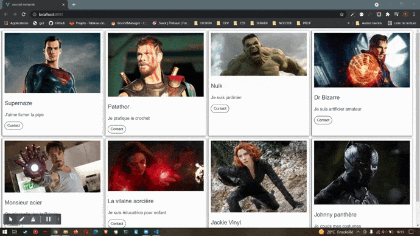

# asocial-network

Créer un réseau associal de super-héros.

# Fonctionnalités

L'application devra permettre : 

    - de visualiser chaque membre du réseau social sous forme de carte depuis les données présentes à la racine de l'application
    - chaque carte devra pemrmettre d'entrer en contact avec le membre ciblé
    - lorsqu'un membre est demandé comme contact par l'utilisateur, un message de refus est affiché dans la carte correspondante

# Modèle html 

d'une carte : 

    <div class="card">
        
        <p class="memberName">NomDuMembre</p>
        <p>HobbyDuMembre</p>
        <button>
        Contact
        </button>
        <p v-else class="msg">MessageDuMembre</p>
    </div>


    
# Affichage



## Project setup
```
npm install
```

### Compiles and hot-reloads for development
```
npm run serve
```

### Compiles and minifies for production
```
npm run build
```

### Customize configuration
See [Configuration Reference](https://cli.vuejs.org/config/).
