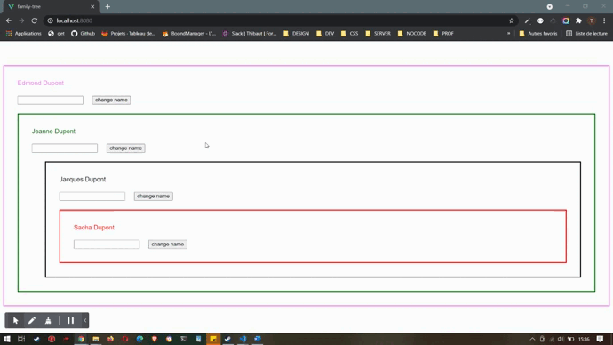

# family-tree

Développer une application qui permet à chaque membre d'une même famille de changer son prénom.

Cette famille est composée d'un grand-parent, d'un parent, d'un enfant et d'un petit-enfant.
Chaque membre de la famille peut demander à changer de prénom.
Dans cette famille, c'est le grand-parent qui a le dernier mot, c'est lui qui effectue le changement de prénom demandé par l'un de ses enfants.
Chaque enfant du grand-parent doit avertir son propre parent qu'il veut changer de prénom.
Même le grand-parent doit avertir l'application qui le contient qu'il désire changer de prénom.

---
## fonctionnalités

l'application devra : 
- afficher un composant grand-parent 
- afficher un composant parent depuis le composant grand-parent
- afficher un composant enfant depuis le composant parent
- afficher un composant petit-enfant depuis le composant enfant

Chaque composant devra : 
- afficher son nom complet à partir des données présentes dans l'application
- afficher tous ses enfants ainsi que leur nom complet via une propriété calculée
- permettre la modification de son prénom grâce à un input et à un boutton en passant par tous ses parents(la modification du prénom du composant qui effectue la demande doit exclusivement être faite au niveau le plus haut, celui de l'application)

---

## affichage



## Project setup
```
npm install
```

### Compiles and hot-reloads for development
```
npm run serve
```

### Compiles and minifies for production
```
npm run build
```

### Customize configuration
See [Configuration Reference](https://cli.vuejs.org/config/).
