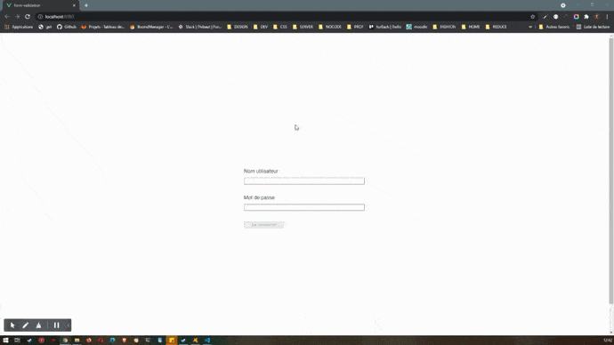

# form-validation

Un client a besoin d'un formulaire de connection utilisateur avec un minimum de sécurité et de retour utilisateur.


# fonctionnalités

Cette application devra : 
- vérfier  à la volée le nom entré par l'utilisateur dans un champs approprié 
- vérfier à la volée le mot de passe entré par l'utilisateur dans un champs approprié 
- si n'importe quelle valeur entrée dans un champs par l'utilisateur est trop courte ou trop longue, un message d'erreur devra être affiché.
- cette erreur devra être affichée en rouge, près du champs utilisateur concerné par cette erreur tant qu'elle est effective et disparaitre quand elle ne l'est plus
- tant que la valeur de chaque  champs utilisateurs n'est pas en règle, le bouton submit du formlaire doit être désactivé et donc l'envoi du formulaire impossible.
- si la valeur de chaque  champs utilisateurs est en règle, le bouton submit du formulaire est activable et doit permettre l'envoi du contenu du formulaire.
  

# Affichage




---

## Project setup
```
npm install
```

### Compiles and hot-reloads for development
```
npm run serve
```

### Compiles and minifies for production
```
npm run build
```

### Customize configuration
See [Configuration Reference](https://cli.vuejs.org/config/).
