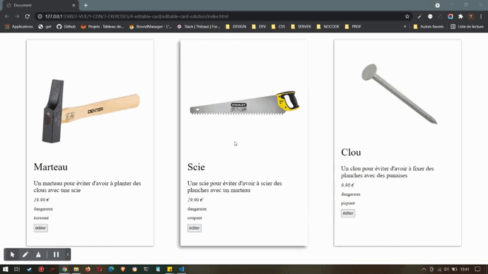

# les cartes éditables

A partir des données fournies, créez une application qui permet d'afficher les produits représentés par ces données.

---

## fonctionnalités 

- A partir des données fournies, créez une application qui permet d'afficher les produits représentés par ces donnée sous forme de carte-produit
- Chaque carte-produit doit permettre son passage en mode édition (les mêmes données mais sous forme de formulaire)
- En mode édition, le formulaire devra : 
  - afficher par défaut et dans chaque champs la bonne données du bon produit
  - permettre l'affichage console d'une version éditée du produit via un gestionnaire d'événement
  - Une carte-produit qui entre en mode édition clos le mode édition de toutes les autres carte-produits
- Le formulaire d'édition et l'affichage normal doivent être des composants vue.js

---

## Affichage

