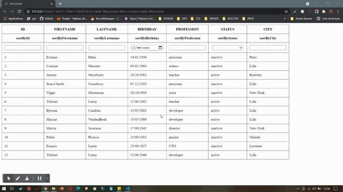

# tableau filtrable

Un client a besoin d'une application qui permet de visualiser ses clients avec efficacité
Les données sont présentes sur une api temporaire (json-server)

# fonctionnalités 

Cette application doit permettre : 
- la visualisation des données de chaque client dans un tableau
- le tri cumulatif du tableau en fonction de chacune de ses propriétés
- chaque tri devra être déclenché lors d'un changement de valeur dans un champs de tri utilisateur

# conseils 

- npx json-server --watch bdd.json

# affichage

