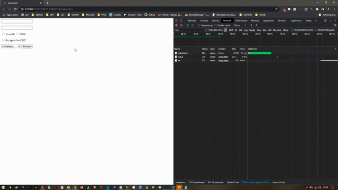

**_Le Formulaire_**

Réaliserun formulaire d'inscription avec les données suivantes:

    - Le nom et le prénom de l'utilisateur;
    - Une case à cocher de validation des CGU;
    - Deux radio buttons pour sélectionner le sexe de l'utilisateur;
    - Un select pour choisir la situation de l'utilisateur ("Non indiqué", "Etudiant", "Employé", "Sans emploi");La validation ne doit pouvoir se - faire que si les règles suivantes sont respectées:
    - Un utilisateur doit obligatoirement remplir son nom et prénom;
    - Les CGU doivent être acceptées;
    - Le sexe et la situation doivent être renseignés.

---

**_Affichage_**

