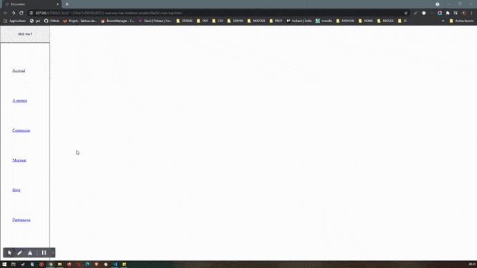

# La barre de navigation

Créer une application de type "barre de navigation" avec Vue.

Pour référence, vous avez comme modèle HTML le code suivant :

    <!DOCTYPE html>
    <html lang="en">
    <head>
        <meta charset="UTF-8" />
        <meta name="viewport" content="width=device-width, initial-scale=1.0" />
        <link rel="stylesheet" href="./style.css" />
        <title>Document</title>
    </head>
    <body>
        <main id="app">
            <nav>
                <ul>
                    <li class="nav-item">      
                        <a href="/">Accueil</a> 
                    </li>
                    <li class="nav-item">      
                        <a href="/about">A propos</a> 
                    </li>
                    <li class="nav-item">      
                        <a href="/login">Connexion</a> 
                    </li>
                    <li class="nav-item">      
                        <a href="/qhop">Magasin</a> 
                    </li>
                    <li class="nav-item">      
                        <a href="/blog">Blog</a> 
                    </li>
                    <li class="nav-item">      
                        <a href="/partners">Partenaires</a> 
                    </li>
                    <li class="nav-item">      
                        <a href="/team">Equipe</a> 
                    </li>
                </ul>
            </nav>
        </main>
    </body>
    </html>

## Consignes et conseils :

- le texte affiché dans chaque élément "a" doit provenir de données statiques initialisées depuis l'application vue.
- la valeur de chaque attribut href doit provenir des données.
- ces données statiques doivent être une collection d'objets
- pensez directive
- le style css n'a pas a être modifié
- le bouton doit permettre à l'utilisateur de pivoter l'affichage pour que la barre de navigation disparaisse ou apparaisse.
- n'oubliez pas d'importer vue-core depuis un cdn

---

## Résultat

